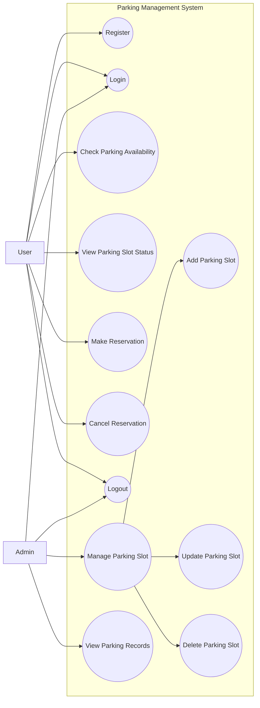

Functional Requirements 
---------------------------------------------------------------------------
ระบบที่จอดรถต้องสามารถแสดงจำนวนช่องจอดรถที่ว่างอยู่ในปัจจุบันได้

ระบบที่จอดรถต้องสามารถแสดงสถานะของช่องจอดรถแต่ละช่อง (ว่าง / ถูกจอง / มีรถจอด)

ระบบที่จอดรถต้องสามารถบันทึกข้อมูลรถที่เข้ามาใช้บริการได้

ระบบที่จอดรถต้องสามารถบันทึกเวลาที่รถเข้าจอดและออกจากช่องจอดได้

ระบบที่จอดรถต้องสามารถคำนวณระยะเวลาการจอดรถของรถแต่ละคันได้

ระบบที่จอดรถต้องสามารถคำนวณค่าธรรมเนียมการจอดรถตามระยะเวลาการจอดได้

ผู้ใช้สามารถจองช่องจอดรถล่วงหน้าผ่านระบบที่จอดรถได้

ผู้ใช้สามารถยกเลิกการจองช่องจอดรถได้

เมื่อหมดเวลาการจอง ระบบที่จอดรถต้องปรับสถานะช่องจอดรถกลับเป็น “ว่าง” โดยอัตโนมัติ

ผู้ดูแลระบบสามารถเพิ่ม ลบ หรือแก้ไขข้อมูลช่องจอดรถในระบบได้

Non-Functional Requirementsz
---------------------------------------------------------------------------

ระบบที่จอดรถควรใช้งานง่าย ไม่ซับซ้อน และเข้าใจได้ง่าย

ระบบที่จอดรถต้องสามารถแสดงผลข้อมูลได้อย่างรวดเร็ว

ระบบที่จอดรถควรมีความเสถียร และรองรับการใช้งานพร้อมกันหลายผู้ใช้ได้

ระบบที่จอดรถต้องมีความถูกต้องและแม่นยำในการคำนวณเวลาการจอดและค่าธรรมเนียม

ระบบที่จอดรถควรมีความปลอดภัยในการจัดเก็บข้อมูลรถและข้อมูลผู้ใช้งาน

--------------------------------------------------------------------------

## ข้อกําหนดคุณสมบัติระบบโครงการพัฒนาระบบบริหารจัดการที่จอดรถ (TOR)

เอกสารฉบับนี้จัดทำขึ้นเพื่อกำหนดขอบเขต วัตถุประสงค์ และคุณสมบัติของระบบบริหารจัดการที่จอดรถ ซึ่งเป็นระบบต้นแบบสำหรับการศึกษาและการพัฒนาเชิงวิชาการ 
โดยระบบถูกออกแบบในรูปแบบ Web-based Application แยกการทำงานเป็นส่วนของ Front-End และ Back-End 

1. วัตถุประสงค์ของโครงการ

เพื่อพัฒนาระบบที่สามารถบริหารจัดการข้อมูลช่องจอดรถได้อย่างเป็นระบบ

เพื่ออำนวยความสะดวกแก่ผู้ใช้งานในการตรวจสอบสถานะช่องจอดรถและการจองล่วงหน้า

เพื่อช่วยให้ผู้ดูแลระบบสามารถจัดการข้อมูลช่องจอดรถได้อย่างมีประสิทธิภาพ

เพื่อใช้เป็นระบบต้นแบบสำหรับการเรียนรู้และการพัฒนาระบบสารสนเทศ

2. ขอบเขตของระบบ

ระบบบริหารจัดการที่จอดรถเป็นระบบแบบ Web-based Application โดยแบ่งขอบเขตการทำงานออกเป็น 2 ส่วนหลัก ได้แก่

ระบบแสดงผลและการใช้งานสำหรับผู้ใช้ (Front-End)

ระบบประมวลผลและจัดการข้อมูลสำหรับผู้ดูแลระบบ (Back-End)

ครอบคลุมการทำงานดังต่อไปนี้

การแสดงข้อมูลและสถานะช่องจอดรถ

การบันทึกข้อมูลรถและเวลาเข้า–ออก

การคำนวณระยะเวลาการจอดและค่าธรรมเนียม

การจองและยกเลิกการจองช่องจอดรถ

การจัดการข้อมูลระบบโดยผู้ดูแลระบบ

3. Functional Requirements
3.1 ระบบแสดงผลสำหรับผู้ใช้ (Front-End)

3.1.1 ระบบต้องสามารถแสดงจำนวนช่องจอดรถที่ว่างอยู่ในปัจจุบันได้

3.1.2 ระบบต้องสามารถแสดงสถานะของช่องจอดรถแต่ละช่อง โดยมีสถานะดังนี้

- ว่าง

- ถูกจอง

- มีรถจอด

3.1.3 ระบบต้องสามารถแสดงข้อมูลช่องจอดรถในรูปแบบที่เข้าใจง่าย เช่น ตารางหรือรายการ

3.1.4 ผู้ใช้งานสามารถจองช่องจอดรถล่วงหน้าผ่านระบบได้

3.1.5 ผู้ใช้งานสามารถยกเลิกการจองช่องจอดรถได้

3.1.6 ระบบต้องแสดงผลการจองหรือยกเลิกการจองให้ผู้ใช้งานทราบทันที

3.2 ระบบจัดการและประมวลผลข้อมูล (Back-End)

3.2.1 ระบบต้องสามารถบันทึกข้อมูลรถที่เข้ามาใช้บริการได้ เช่น หมายเลขทะเบียนรถ

3.2.2 ระบบต้องสามารถบันทึกเวลาที่รถเข้าจอดและออกจากช่องจอดได้

3.2.3 ระบบต้องสามารถคำนวณระยะเวลาการจอดรถของรถแต่ละคันได้โดยอัตโนมัติ

3.2.4 ระบบต้องสามารถคำนวณค่าธรรมเนียมการจอดรถตามระยะเวลาการจอดได้

3.2.5 เมื่อหมดเวลาการจอง ระบบต้องปรับสถานะช่องจอดรถกลับเป็น “ว่าง” โดยอัตโนมัติ

3.2.6 ผู้ดูแลระบบสามารถเพิ่ม ลบ หรือแก้ไขข้อมูลช่องจอดรถภายในระบบได้

3.2.7 ระบบต้องจัดเก็บและจัดการข้อมูลทั้งหมดไว้ในฐานข้อมูลอย่างเป็นระบบ

4. Non-Functional Requirements
4.1 ด้านการใช้งาน (Usability)

ระบบที่จอดรถควรใช้งานง่าย ไม่ซับซ้อน และเข้าใจได้ง่ายสำหรับผู้ใช้งานทั่วไป โดยไม่จำเป็นต้องมีความรู้ทางเทคนิคมาก่อน

4.2 ด้านประสิทธิภาพ (Performance)

ระบบต้องสามารถแสดงผลข้อมูลได้อย่างรวดเร็ว และตอบสนองต่อการทำงานของผู้ใช้งานได้อย่างเหมาะสม

4.3 ด้านความเสถียร (Reliability)

ระบบควรมีความเสถียรและสามารถรองรับการใช้งานพร้อมกันของผู้ใช้งานหลายคนได้โดยไม่เกิดความผิดพลาด

4.4 ด้านความถูกต้อง (Accuracy)

ระบบต้องมีความถูกต้องและแม่นยำในการบันทึกเวลา การคำนวณระยะเวลาการจอด และค่าธรรมเนียม

4.5 ด้านความปลอดภัย (Security)

ระบบควรมีมาตรการรักษาความปลอดภัยในการจัดเก็บข้อมูลรถและข้อมูลผู้ใช้งาน เพื่อป้องกันการเข้าถึงข้อมูลโดยไม่ได้รับอนุญาต

5. กลุ่มผู้ใช้งานระบบ
5.1 ผู้ใช้งานทั่วไป (User)

ตรวจสอบสถานะช่องจอดรถ

จองช่องจอดรถล่วงหน้า

ยกเลิกการจองช่องจอดรถ

5.2 ผู้ดูแลระบบ (Admin)

จัดการข้อมูลช่องจอดรถ (เพิ่ม ลบ แก้ไข)

ตรวจสอบข้อมูลการใช้งานของระบบ

6. ข้อจำกัดของระบบ

ระบบนี้เป็นโครงการต้นแบบเพื่อการศึกษา

ไม่รองรับการใช้งานในระดับองค์กรขนาดใหญ่

ใช้เพื่อสาธิตแนวคิดและการทำงานของระบบบริหารจัดการที่จอดรถเท่านั้น
